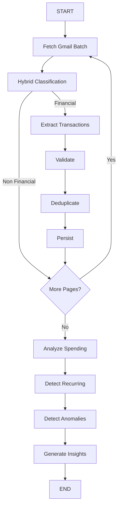

# SpendLens Backend

SpendLens uses a sophisticated LangGraph orchestrator to deterministically process financial emails.

## Architecture

The orchestration uses LLMs purely for semantic understanding (classification, extraction, and text generation) while leaning entirely on deterministic Python/SQL code for financial calculations, deduplication, and anomaly detection. 

## Running the app
1. Set up `.env` with `DATABASE_URL`, `GEMINI_API_KEY`, and Google OAuth credentials.
2. Run `alembic upgrade head`
3. Run `uvicorn backend.main:app --reload`
